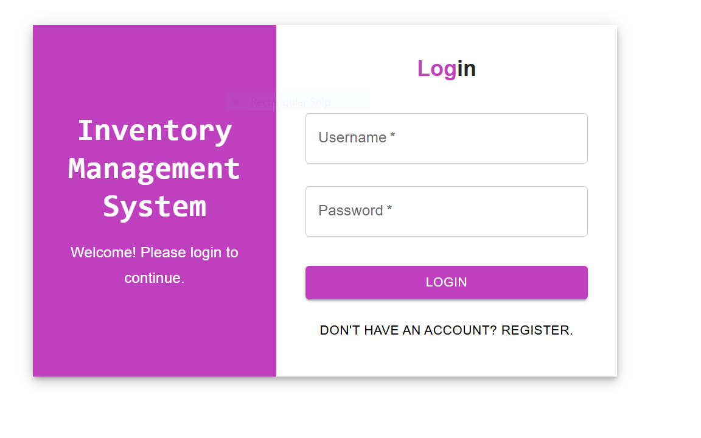
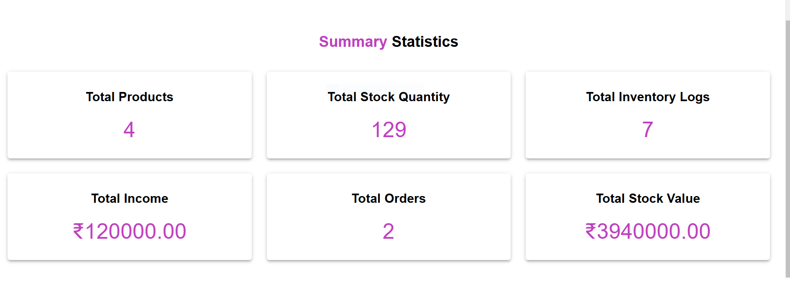
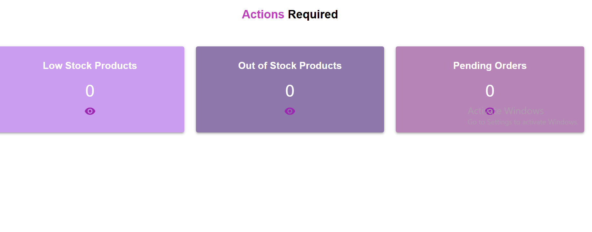
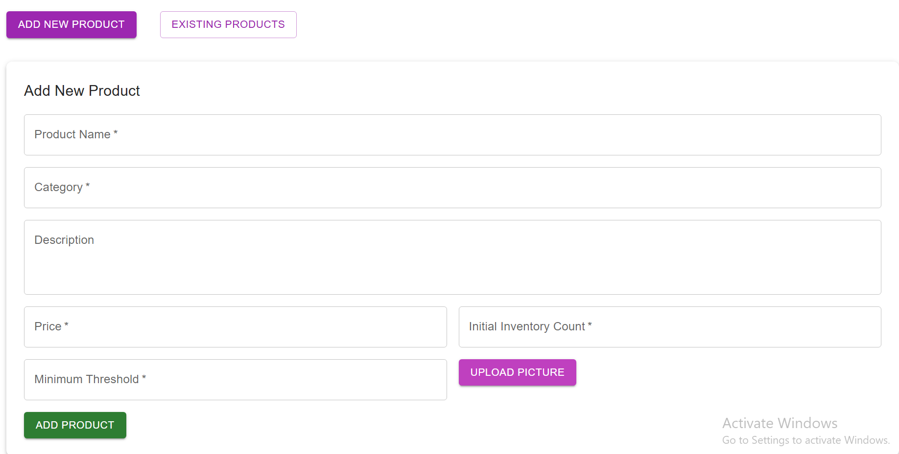
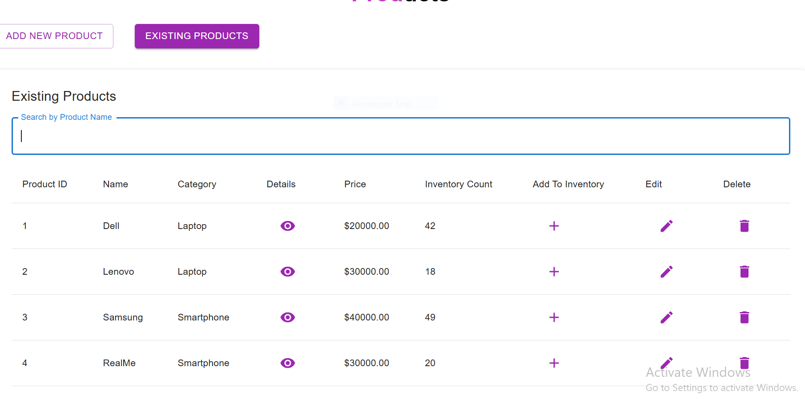
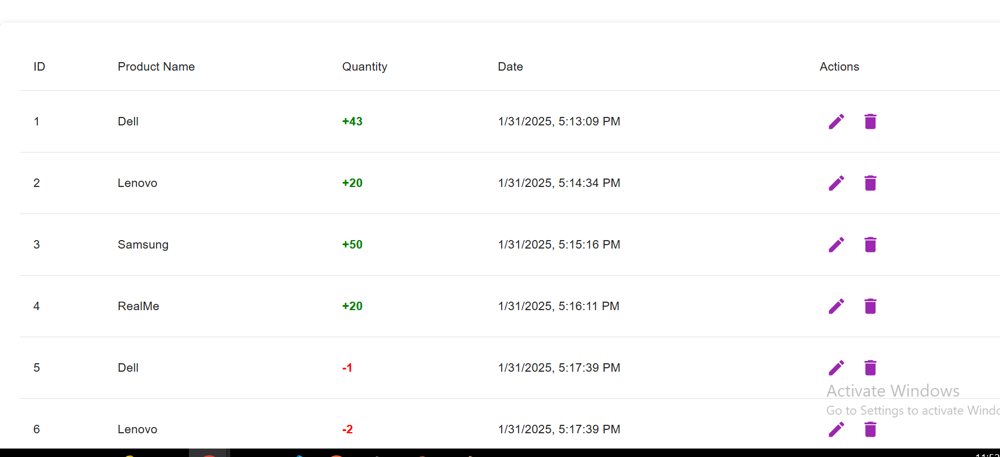
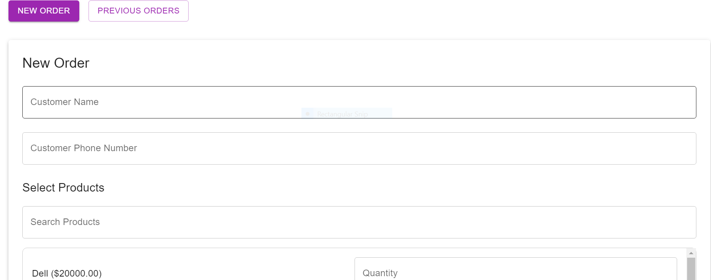
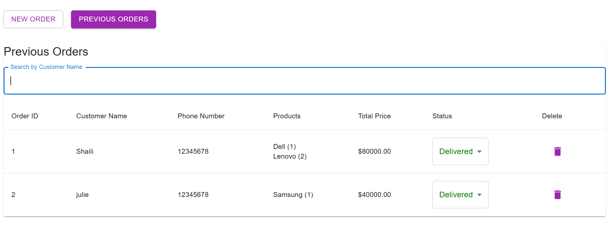
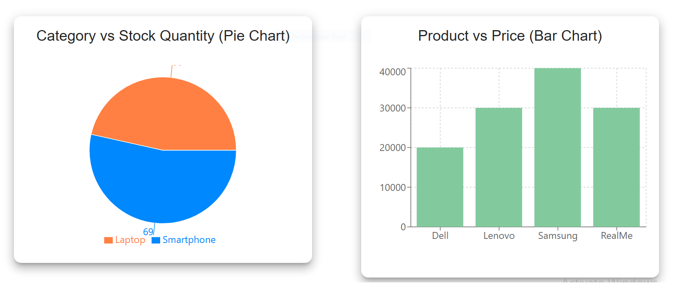
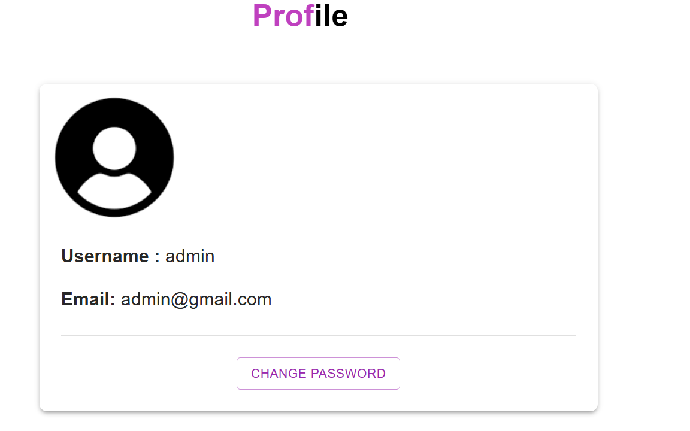

# Inventory Management System

## **Overview**
This is a full-stack **Inventory Management System** designed for small businesses.It provides an efficient solution to manage products, stock , categories and orders providing insights into stock trends and order patterns. This system enhances operational efficiency and ensuress seamless inventory tracking for business


## **Features**
- **User Authentication** (JWT-based login & registration)
- **Dashboard** with inventory summaries & pending orders
- **Products Management** (Add, View, Edit, Delete, Search)
- **Orders Management** (Create, View, Update Status, Delete, Search)
- **Inventory Logs** (Track all inventory changes)
- **Graphical Insights** using charts
- **Image Upload** for products


## Database Design
### CustomUser
#### Attributes
- business_name
- phone_number

### Category
#### Attributes
- name

### Product
#### Attributes
- name
- category
- description
- stock_quantity
- threshold
- created_by
- image
- created_at
- updated_at

### InventoryLog
#### Attributes
- Product
- user
- quantity
- created_at

### Order
#### Attributes
- user
- customer_name
- customer_phone_number
- total_price
- created_at
- updated_at

### OrderItem
#### Attributes
- Order
- Product
- Quantity


## Tech Stack

- **Frontend** : React.js, Material-UI
- **Backend**:Django Rest Framework(DRF)
-  **Database:** SQLite.
- **Security:** Uses JWT tokens for authentication and CORS policies for API access.
- **Other_Tools**: AXIOS for API calls, Recharts for data visualization

## Prerequisites
- Node.js(v14 or higher)
- npm(Node package Manager)
- Python (v3.6 or higher)
- Django (v3.2 or higher)
- Django Rest FRamework

## **Project Structure**

```bash
Inventory-management/
├── inventory_management/
│   ├── inventory/        # Core business logic & models
│   │   ├── admin.py
│   │   ├── models.py
│   │   ├── serializers.py
│   │   ├── urls.py
│   │   ├── views.py
│   ├── inventory_management/
│   │   ├── settings.py       # Django project settings
│   │   ├── urls.py           # API Routing
│   └── requirements.txt         # Requirements File
│
├── frontend/
│   ├── public/
│   │   ├── index.html
│   ├── src/
│   │   ├── components/   # React Components
│   │   │   ├── Dashboard.js
│   │   │   ├── Graphs.js
│   │   │   ├── InventoryLog.js
│   │   │   ├── Login.js
│   │   │   ├── Navbar.js   # Navigation Bar
│   │   │   ├── Orders.js
│   │   │   ├── PrivateRoute.js
│   │   │   ├── Products.js
│   │   │   ├── Profile.js
│   │   │   ├── Register.js
│   │   ├── App.js        # Main React App
│   │   ├── index.js      # React Entry Point
│   ├── package.json
└── README.md            # Project Documentation
```

## steps to run  project
##### For running backend
1.clone the repository:
```
git clone "https://github.com/zoyamariam2001/Inventory_Management_System.git"
```

2.Move to directory
```
cd Inventory-management/inventory_management
```

3.Install Packages
```
python -m pip install -r requirements.txt
```

4.Make migrations
```
python manage.py makemigrations
```

4.Migrate
```
python manage.py migrate
```

3.Run the server in 8198 port
```
python manage.py runserver 8198
```
##### For Frontend
4.Move to directory
```
cd frontend
```
5.Install npm
```
npm i
```
6.Run npm
```
npm start
```


---


## **Project Setup**

### **Backend Setup**
```bash
# Clone the repository
git clone https://github.com/zoyamariam2001/Inventory_Management_System.git
cd Inventory_Management_System/Inventory-management/inventory_management

# Create Virtual Environment & Install Dependencies
python -m venv venv
source venv/bin/activate  # On Windows use: venv\Scripts\activate
pip install -r requirements.txt

# Apply Migrations & Run Server
python manage.py makemigrations
python manage.py migrate
python manage.py runserver 8198
```

### **Frontend Setup**
```bash
cd Inventory_Management_System/frontend

# Install dependencies
npm install

# Start React development server
npm start
```

---

## **API Documentation**

### **Authentication**
| Method | Endpoint | Description |
|--------|----------------------|--------------------------------|
| POST | `/api/register/` | Register a new user |
| POST | `/api/token/` | Get access token |

### **Products API**
| Method | Endpoint | Description |
|--------|----------------------|--------------------------------|
| GET | `/api/get/user_product/` | Fetch products created by user |
| GET | `api/get/product/<id>` | Get Product by ID |
| POST | `/api/add_product/` | Add a new product |
| PATCH | `/api/update_product/<id>/` | Update product details |
| DELETE | `/api/delete_product/<id>/` | Delete a product |

### **Orders API**
| Method | Endpoint | Description |
|--------|----------------------|--------------------------------|
| POST | `/api/place_order/` | Place a new order |
| GET | `/api/get/orders/` | Fetch user's orders |
| GET | `/api/get/orders/<id>` | Fetch order by ID |
| PATCH | `/api/order_status/<id>/` | Update order status |
| DELETE | `/api/delete/orders/<id>/` | Delete an order |

### **Inventory Log API**
| Method | Endpoint | Description |
|--------|----------------------|--------------------------------|
| POST | `/api/inventory/create` | Create a new log entry |
| GET | `/api/get/orders/` | Fetch user's orders |
| GET | `/api/inventory/get/<id>` | Fetch log entry by ID |
| PATCH | `/api/inventory/update/<id>/` | Edit log entry |
| DELETE | `/api/inventory/delete/<id>` | Delete a log entry |

### **User Details API**
| Method | Endpoint | Description |
|--------|----------------------|--------------------------------|
| GET | `/api/profile/` | Get details of user |
| PATCH | `/api/change_password/` | Change password of user |

### **Graph Trends API**
| Method | Endpoint | Description |
|--------|----------------------|--------------------------------|
| GET | `/api/get/trends/` | Get trends of stock according to date |
| PATCH | `/api/get/order_trends/` | Get trends of order according to month |

---

### Components

#### 1. **Dashboard**
- **Description:** Displays the main dashboard for the application. This typically includes key metrics and summaries relevant to the business activities.

#### 2. **Graphs**
- **Description:** Visual representation to compare insights and other useful insights.

#### 3. **InventoryLog**
- **Description:** Shows a log for addition and removal of stocks along with updation and deletion features.

#### 4. **Login**
- **Description:** Allows logging in for a user with valid username and password.

#### 5. **Navbar**
- **Description:** The navigation bar for the application. Provides links to different sections and is typically displayed at the top of the page.

#### 6. **Orders**
- **Description:** User can Create a new order with multiple items and even view list of all orders, change status of order and delete orders

#### 7. **PrivateRoute**
- **Description:** This component is used to protect specific routes in application by restricting access to authenticated users only

#### 8. **Products**
- **Description:** User can  add a new product along with its image, update the product view product details and delete the product.

#### 9. **Profile**
- **Description:** Displays the profile of user. This also includes changing password for more security.

#### 10. **Register**
- **Description:** Allows registration of new user who don't have an account.

## Overview of website
### Login page


### Dashboard page



### Products page



### InventoryLog page


### Orders page



### Graphs page


### Profile page



## **Contributors**
- **Zoya Patel** - Developer
- **Shruti Kumari** - Developer

---

## **Division of Tasks**
- **Zoya Patel** - 
- **Shruti Kumari** - 

---
